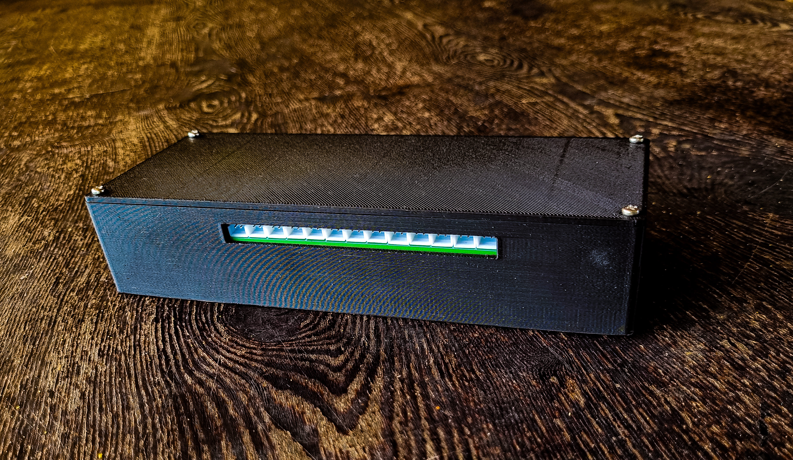
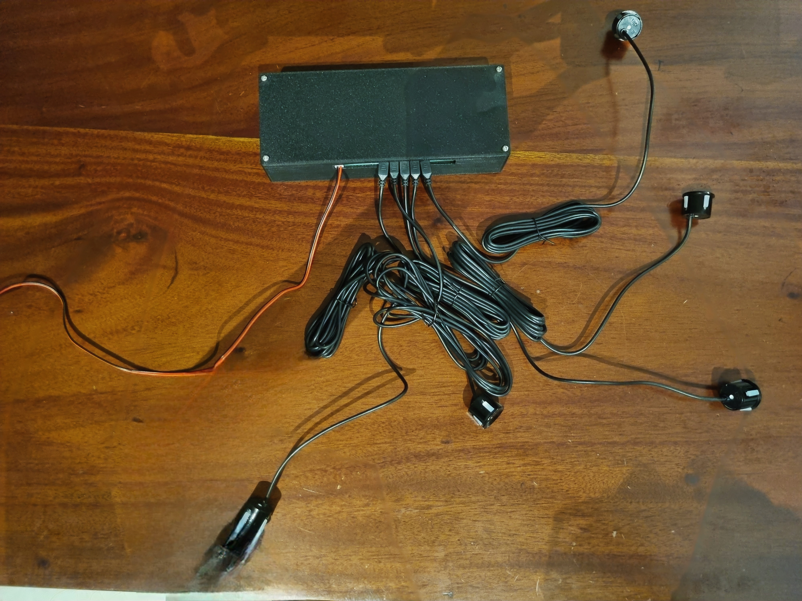
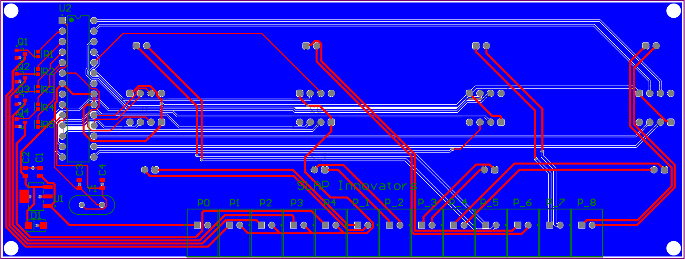
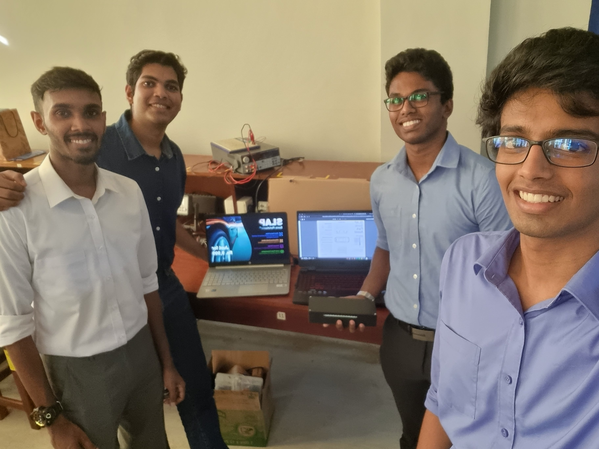

# SLAP-Sonic ParkAssist – Parking Made Smarter 🚗💡

<figure>
  
  <figcaption>Product Enclosure.</figcaption>
</figure>

<figure>
  
  <figcaption>Enclosure with sensors.</figcaption>
</figure>

## Overview
SLAP-Sonic ParkAssist is an innovative parking assistance system designed to make parking safer and more intuitive. Developed as part of our Semester 2 Engineering Design Project, this system uses ultrasonic sensors and directional speakers to guide the driver through tight parking situations, providing real-time, location-based audio feedback.

This project combines precision, reliability, and practicality to create a smarter way to park.

## Features
- **8 Ultrasonic Sensors**: Strategically placed at the front and back of the vehicle to detect obstacles with precision.
- **4 Directional Speakers**: Positioned at each corner of the car, these speakers provide real-time audio feedback based on the location of the obstacle. No distracting displays are needed.
- **Waterproofing**: Carefully selected sensors to ensure reliable performance under varying weather conditions.
- **Smart Microcontroller Programming**: Uses Arduino and `millis()` for efficient management of parallel tasks to keep the system responsive and efficient.

## Key Components
- **Ultrasonic Sensors**: For detecting obstacles in the vehicle’s proximity.
- **Directional Speakers**: For providing location-based audio cues.
- **Microcontroller**: Responsible for processing sensor data and controlling the speakers.

## How It Works
SLAP-Sonic ParkAssist works by using a combination of ultrasonic sensors to detect obstacles at the front and rear of the car. The system then processes the distance data and provides real-time audio feedback through four strategically placed speakers around the vehicle.

### Step-by-step operation:
1. **Sensors are activated**: The ultrasonic sensors measure the distance to nearby obstacles.
2. **Data Processing**: The microcontroller analyzes the data from the sensors to determine the location and proximity of obstacles.
3. **Audio Feedback**: Based on the location and proximity of the obstacle, the corresponding speaker emits an audio signal, helping the driver navigate in real-time.
4. **Adaptive System**: The use of `millis()` in Arduino ensures that the system runs efficiently by managing parallel actions, providing smooth and continuous feedback.

## Circuit Diagram
<figure>
  
  <figcaption>PCB Wiring Diagram.</figcaption>
</figure>

## Setup & Usage
1. **Assemble the Hardware**: Connect the ultrasonic sensors and buzzers to the main ports according to the user manual.
2. **Connect the Sensors to the Car**: Carefully drill holes with the provided drill bit and wire the sensors to the relevant positions.
3. **Connect the Speaker**: Wire the buzzers to the four corners of the car.
4. **Power Up**: Connect the product to a 12V power line of the car.
5. **Test the System**: The system will begin providing real-time audio feedback as the vehicle moves, helping the driver navigate tight parking spaces.

## Challenges Faced
- **Sensor Placement and Calibration**: Positioning the sensors correctly to ensure accurate obstacle detection while accounting for vehicle dimensions.
- **Audio Feedback Optimization**: Ensuring clear, directional audio feedback that guides the driver effectively without causing confusion.
- **Parallel Processing**: Implementing parallel actions efficiently in the microcontroller to handle multiple sensor readings and feedback loops in real-time.

## Future Improvements
- **Enhanced Sensor Accuracy**: Integrating additional sensors or advanced technologies like radar or LIDAR for even better obstacle detection.
- **Product Size**: Making the product more compact by integrating the sensor modules into the main PCB, saving space in the trunk of the car.
- **Power Management**: Improving the power efficiency of the system for long-term use and minimal impact on vehicle battery life.

## Acknowledgements
- [Pravindu Goonetilleke](https://github.com/PravinduG)
- [Amoda Attanayake](https://github.com/AmodaA)
- [Lahiru Perera](https://github.com/LahiruCKPerera)
- [Sithum de Zoysa](https://github.com/sithum02)

## The team

## Circuit Diagram
<figure>
  
  <figcaption>The team.</figcaption>
</figure>
